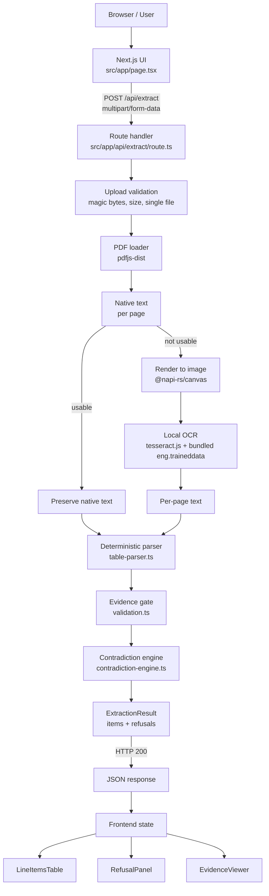

# InstaQuote PDF Extractor

A conservative, evidence-backed full-stack PDF line-item extractor for trade
invoices and quotes. Native text is preferred; image-only pages fall back to
local OCR. Every accepted numeric value is tied to a specific page and an
exact verbatim excerpt of the source text. Missing, contradictory, or
otherwise unverifiable values are surfaced as structured refusals instead of
being silently guessed or repaired.

[](https://insta-quote-pdf-extractor.vercel.app)


No external OCR SaaS, no LLM, no API keys, no Docker, no system Tesseract, no Poppler.

> **Central principle.** A value is only accepted when it can be traced to a
> specific page and exact source text. Refusal is preferred over unsupported
> inference.

---

## Overview

The application ships as a single Next.js project:

- A deterministic extraction pipeline that turns a PDF into a structured
  `ExtractionResult` containing verified line items and structured
  refusals.
- A small web application that lets a user upload a PDF, view the parsed
  line items, inspect source evidence for every accepted value, and read
  plain-language explanations for every refusal.

The central engineering concern is not maximizing extraction coverage. It
is reading imperfect documents, knowing when not to trust a value,
retaining source evidence for everything that is accepted, and preserving
meaningful failures across the backend, the API boundary, and the UI.

> A confidently wrong number is worse than an explicit refusal.

---

## Key capabilities

### Document extraction

- Native PDF text extraction, page by page, with layout fidelity preserved
  via `pdfjs-dist`.
- Page-level OCR fallback for image-only, scanned, or nearly blank pages
  using `@napi-rs/canvas` rasterization and local `tesseract.js`.
- Deterministic line-item parser that recognizes code-prefixed rows
  (`FX-201`, `EL-902`, `CX-1000`, ...) and classifies headers, totals,
  separators, and metadata as non-items.
- Raw value preservation — quantities, weights, and prices are returned as
  verbatim strings (`"3"`, `"$74.00"`, `"20kg"`, `"640g total"`); the
  pipeline never silently converts units or normalizes magnitudes.
- Page references are strictly 1-based and preserved for every accepted
  value.

### Evidence and safety

- Every accepted numeric business field (`quantity`, `weight`, `unitPrice`,
  `amount`) carries an `Evidence` object with the page number, the verbatim
  `sourceText`, and the extraction method.
- Token-boundary verification prevents digits inside product codes
  (`FX-401`), units (`15mm`), or other amounts (`$74.00`) from satisfying
  numeric-field validation.
- Missing amounts are never calculated. When the source document does not
  print an amount column, the `amount` field is omitted from the response
  and the UI renders the cell as `Not in source`.
- Contradictions in the source document — conflicting carton counts, a
  printed total that does not sum with subtotal and GST — are surfaced as
  `CONTRADICTORY_VALUES` refusals with every conflicting source line
  preserved as evidence.
- Low-confidence OCR pages are refused via `OCR_LOW_CONFIDENCE` rather than
  treated as text.

### Full-stack reliability

- Partial-success responses are a first-class outcome: a document with one
  failed page and seven successful pages returns HTTP 200 with the seven
  pages of items plus a `PAGE_EXTRACTION_FAILED` refusal for the failed
  page.
- Meaningful API errors at the HTTP boundary (missing file, empty file,
  non-PDF, oversized upload, encrypted or corrupt PDF) carry stable
  machine-readable codes and human-readable messages.
- Refusals are domain data, not generic application errors. They reach the
  frontend as structured `Refusal` objects and are rendered with their full
  message and any source evidence quotes — never replaced with a generic
  "Something went wrong".
- Page-level failures are isolated inside the pipeline; one broken page
  cannot destroy extraction from the rest of the document.

---

## System architecture



Layers in the source tree:

| Layer | Responsibility |
|---|---|
| `src/app/page.tsx` | Upload UI, result rendering, evidence inspection |
| `src/app/api/extract/route.ts` | Multipart upload validation, pipeline orchestration, HTTP error mapping |
| `src/extraction/pdf/` | Native PDF text extraction with layout preservation |
| `src/extraction/ocr/` | Image rasterization + bundled OCR worker lifecycle |
| `src/extraction/parser/` | Row classification, column tokenization, contradiction detection |
| `src/domain/` | Pure Zod-validated contracts: `LineItem`, `Evidence`, `Refusal`, `ExtractionResult`, API envelopes |
| `src/components/` | UI components: dropzone, summary, line-items table, refusal panel, evidence viewer |

The document-processing backend has no database, no message queue, no
object storage, no external AI service, and no background worker.
Extraction runs synchronously within the Node.js `/api/extract` function.

---

## Extraction workflow

```
PDF upload
   |
   v
Validate file
   |
   v
Open document
   |
   v
For each page independently:
   |
   +--> Attempt native text (pdfjs-dist)
   |
   +--> Is native text usable?
   |       |
   |       +-- yes --> preserve native text
   |       |
   |       +-- no  --> render page to image
   |                  |
   |                  v
   |                OCR (tesseract.js, local eng.traineddata)
   |
   v
Parse candidate rows
   |
   v
Validate every numeric field against evidence
   |
   v
Detect ambiguity / contradiction
   |
   v
Return: { items, refusals }
```

The parser **may miss a value**. It **does not invent a value**.

### Worked example — `IB-56010.pdf`

A supplied fixture prints the following row:

```
FX-401  Coach screws, bulk carton  3  20kg  $74.00 /carton
```

The parser recognizes:

- `code` = `FX-401`
- `quantity` = `3`
- `weight` = `20kg`
- `unitPrice` = `$74.00 /carton`

The document has **no amount column**. The parser therefore returns:

```json
{
  "code": "FX-401",
  "description": "Coach screws, bulk carton",
  "quantity": "3",
  "weight": "20kg",
  "unitPrice": "$74.00 /carton"
}
```

The `amount` field is omitted from the response because it does not exist
in the source text. The derived value `3 × $74.00` is **never** returned,
never displayed, never written into any JSON. The UI explicitly renders
the amount cell as `Not in source`.

---

## Evidence model

Every accepted numeric business value must be supported by an `Evidence`
record that traces it back to source.

```json
{
  "code": "FX-201",
  "description": "Framing nail gun coil, 90mm galv",
  "quantity": "24",
  "unit": "box",
  "unitPrice": "$52.00",
  "amount": "$1,248.00",
  "page": 1,
  "evidence": {
    "quantity": {
      "page": 1,
      "sourceText": "FX-201 Framing nail gun coil, 90mm galv 24 box $52.00 $1,248.00",
      "method": "native"
    },
    "unitPrice": {
      "page": 1,
      "sourceText": "FX-201 Framing nail gun coil, 90mm galv 24 box $52.00 $1,248.00",
      "method": "native"
    },
    "amount": {
      "page": 1,
      "sourceText": "FX-201 Framing nail gun coil, 90mm galv 24 box $52.00 $1,248.00",
      "method": "native"
    }
  }
}
```

For OCR-extracted values, the `Evidence` object additionally carries a
`confidence` field (0–100, Tesseract page-level average).

The four numeric business fields subject to the Evidence Invariant are
defined in `src/domain/line-item.ts`:

```ts
export const NUMERIC_BUSINESS_FIELDS = [
  "quantity",
  "weight",
  "unitPrice",
  "amount",
] as const;
```

Non-numeric fields such as `code` (`"FX-401"`) and `description`
(`"Coach screws 10mm"`) frequently contain digits. They are **not**
subject to the Evidence Gate, and digits inside them are deliberately
ignored so that they do not accidentally satisfy numeric validation.

Verification uses a strict token-boundary lookaround:

```
(?<![0-9A-Za-z-,.%]) <candidate> (?![0-9A-Za-z-,.%])
```

This prevents substring matches such as `401` matching inside `FX-401`,
`15` matching inside `15mm`, and `74` matching inside `$74.00`.

---

## Refusal model

Refusals are first-class domain results. They are **not** generic
application errors and are never thrown as exceptions. They reach the API
response and the frontend as structured `Refusal` objects.

### Contradiction example — `IB-56088.pdf`

The document prints two conflicting lines:

```
Summary: 9 cartons dispatched from Ironbark warehouse this run.
Warehouse notes: 11 cartons picked and loaded onto the truck.
```

The parser:

- Does not select `9`.
- Does not select `11`.
- Still returns all valid line items.
- Emits a contradiction refusal carrying both source statements as
  evidence.

Representative refusal JSON:

```json
{
  "reasonCode": "CONTRADICTORY_VALUES",
  "message": "Conflicting carton counts detected on page 1: warehouse dispatch summary states '9 cartons dispatched', but warehouse notes state '11 cartons picked and loaded'. Neither figure can be safely accepted as the verified count.",
  "page": 1,
  "field": "cartonCount",
  "evidence": [
    {
      "page": 1,
      "sourceText": "Summary: 9 cartons dispatched from Ironbark warehouse this run.",
      "method": "native"
    },
    {
      "page": 1,
      "sourceText": "Warehouse notes: 11 cartons picked and loaded onto the truck.",
      "method": "native"
    }
  ]
}
```

### Reason codes

The domain model defines the following refusal reason codes:

| Code | Meaning |
|---|---|
| `NOT_PRESENT_IN_SOURCE` | A numeric field was expected but not found in the document |
| `AMBIGUOUS_VALUE` | The value cannot be uniquely determined |
| `CONTRADICTORY_VALUES` | The document contains conflicting figures |
| `OCR_LOW_CONFIDENCE` | OCR confidence is below the safe threshold |
| `PAGE_EXTRACTION_FAILED` | A single page failed; other pages are preserved |
| `UNSUPPORTED_DOCUMENT_STRUCTURE` | No tabular line-item structure detected |

---

## Failure isolation

```
Page 1 --> success
Page 2 --> success
Page 3 --> success
Page 4 --> OCR failure   <-- one bad page
Page 5 --> success
Page 6 --> success
Page 7 --> success
Page 8 --> success
```

Result:

- Pages 1–3 and 5–8 are preserved with their extracted line items.
- Page 4 becomes a `PAGE_EXTRACTION_FAILED` refusal that names the page
  and a human-readable failure reason.
- The overall document `status` becomes `partial_success`.
- The HTTP response remains `200 OK`.

This behavior is verified end-to-end by injecting an intentional OCR
exception on page 4 of `IB-STMT47.pdf`. The test asserts that exactly the
21 surviving line items remain, the refusal correctly attributes page 4,
and the response status is `200`.

> **Known issue.** The current `PAGE_EXTRACTION_FAILED` factory
> (`createPageExtractionFailedRefusal`) interpolates the captured
> exception text directly into the public `message`. The intentional
> acceptance-audit test on page 4 of `IB-STMT47.pdf` relies on this
> behavior (`expect(page4Refusal?.message).toContain("Simulated OCR
> worker crash")`). This means raw exception text — and potentially
> module-level error strings — can reach the user-facing refusal card.
> The right long-term fix is for the pipeline to classify exceptions
> into stable failure categories before formatting the refusal message,
> rather than passing the exception text through. Tracked under
> [Known limitations](#known-limitations).

A row-level failure isolation test additionally verifies that a malformed
row in the middle of a page does not destroy the surrounding rows.

---

## Backend-to-frontend refusal flow

```
Extraction engine
       |
       v
Refusal object (page, field, reasonCode, message, evidence[])
       |
       v
API response (HTTP 200, { ok: true, data: { items, refusals, ... } })
       |
       v
Frontend state (ExtractionResult)
       |
       v
RefusalPanel renders each refusal with:
       - human-readable title
       - reason code
       - page tag
       - full plain-language message
       - side-by-side conflicting source quotes (if any)
```

A refusal must never become a generic "Something went wrong" if the
backend knows the actual reason.

### Distinguishing the two kinds of failure

**Domain refusal** — the document was processed successfully but a
specific value could not be verified.

- Contradiction in the source document.
- OCR uncertainty on a page.
- Page-level extraction failure with other pages preserved.
- Missing numeric field that cannot be inferred.

HTTP status: `200 OK`. Response shape:

```json
{ "ok": true, "data": { "status": "partial_success", "items": [...], "refusals": [...] } }
```

**Request failure** — the request itself could not be processed.

- Missing file.
- Empty file.
- Multiple files uploaded.
- File exceeds the 4 MB limit.
- File is not a PDF (checked by `%PDF-` magic bytes).
- File is corrupt or unparseable.
- File is password-protected or encrypted.

HTTP status: appropriate `4xx` response with a stable error code and a
plain-language message. Response shape:

```json
{ "ok": false, "error": { "code": "FILE_TOO_LARGE", "message": "..." } }
```

The two cases are deliberately distinct: a refusal means the document was
read and a safe answer could not be given; an HTTP error means the request
itself was invalid.

---

## Sample document coverage

The included fixtures drive the implementation and were used to build the
end-to-end test suite. Each row below was verified through the real
extraction pipeline and the real HTTP route handler.

| Document | Scenario | Expected behavior | Result |
|---|---|---|---|
| `IB-55871.pdf` | Clean native PDF with a complete amount column | Native extraction, 4 items, 0 refusals, `status: success` | 4 items, 0 refusals |
| `IB-55902.pdf` | Image-only PDF requiring OCR | Local OCR fallback, 3 items, `method: "ocr"` on each | 3 items, 0 refusals |
| `IB-56010.pdf` | No amount column | No amount is calculated; raw weight strings preserved verbatim | 4 items, 0 refusals, `amount` field omitted |
| `IB-56088.pdf` | Contradictory carton counts (9 vs 11) | Both lines preserved as evidence; `cartonCount` left unassigned | 3 items, 1 `CONTRADICTORY_VALUES` refusal |
| `IB-56150.pdf` | Printed total inconsistent with subtotal + GST | Contradiction surfaced; printed total not silently replaced | 4 items, 1 `CONTRADICTORY_VALUES` refusal |
| `IB-STMT47.pdf` | 8-page statement, mixed native and OCR | Pages 1–3 and 5–8 extracted natively; page 4 falls back to OCR; 24 items | 24 items, 0 refusals |

A separate test forces an OCR failure on page 4 of `IB-STMT47.pdf` and
asserts that 21 items survive plus a `PAGE_EXTRACTION_FAILED` refusal for
page 4. The HTTP status remains `200 OK`.

---

## Technology stack

### Full stack

- **Next.js 15** — App Router, Node.js serverless runtime for the API route
- **React 19**
- **TypeScript 5** — strict mode (`tsconfig.json`)
- **Tailwind CSS 3** — utility-first styling
- **Zod** — runtime schema validation for `LineItem`, `Evidence`, `Refusal`,
  `ExtractionResult`, and the API envelopes

### Document processing

- **pdfjs-dist 4** — native PDF text extraction with layout fidelity
- **@napi-rs/canvas** — server-safe image rasterization for OCR fallback
- **tesseract.js 7** — local OCR engine, no network calls
- **`assets/tessdata/eng.traineddata`** — bundled English language model
  (~5 MB), traced into the serverless bundle via
  `outputFileTracingIncludes`

### Quality and testing

- **Vitest 3** — unit, integration, and acceptance suites
- **@testing-library/react** + **jsdom** — component tests
- **ESLint** with `next/core-web-vitals` and `next/typescript`
- **TypeScript strict mode**

### Deployment

- **Vercel** Node.js Serverless Function (the route handler is explicitly
  pinned to `runtime = "nodejs"` and `dynamic = "force-dynamic"`)
- `@napi-rs/canvas` provides the native rendering binding used by the
  OCR fallback. `@napi-rs/canvas`, `tesseract.js`, and `pdfjs-dist` are
  listed under `serverExternalPackages` so they are not re-bundled by
  the client compiler

External services required: **none**.

---

## Engineering decisions

### 1. Evidence before extraction coverage

Refusal is preferred over guessing. If a numeric value cannot be traced to
a verbatim source excerpt bounded by token boundaries, it is not
returned. The cost is some loss of coverage on unusual documents. The
benefit is that every accepted number is auditable.

### 2. Native text before OCR

A usable native text page (≥30 non-whitespace characters, ≥5 alphanumeric
words, ≥3 text items) is preferred over OCR. OCR is slower, less accurate,
and more error-prone than the embedded text layer when one exists. OCR is
only invoked for pages that fail the usability threshold.

### 3. Local OCR instead of cloud OCR

The OCR engine, language model, and image rasterizer are all bundled with
the deployment. There is no API key, no cloud OCR subscription, and no
external network call. The trade-off is a larger serverless bundle and
slower per-page processing for scanned documents.

### 4. Arithmetic as validation, not source generation

The contradiction engine uses arithmetic (subtotal + GST vs printed total)
internally as a consistency check. When the arithmetic fails, the engine
emits a refusal that **quotes only the source numbers**. The derived
result is never promoted to a document value or public response.

For example, a document that prints Subtotal `$1,270.00`, GST (15%)
`$190.50`, and a printed Total of `$1,501.80` triggers the contradiction
engine when those three lines fail an internal consistency check. The
three source lines are preserved as evidence in the refusal. The
arithmetic result computed by the engine is used only as the trigger; it
is never exposed as an extracted value.

### 5. Refusals as domain data

Contradictions and missing values produce `Refusal` objects inside the
`ExtractionResult`, returned with HTTP 200. They are not promoted to
runtime errors and they do not cause the document to be discarded. Other
pages and other valid items are preserved alongside.

### 6. Page-level failure isolation

Each page is processed independently inside the pipeline. A thrown
exception on one page is caught, recorded as a `PAGE_EXTRACTION_FAILED`
refusal, and processing continues. The Tesseract worker is shared across
OCR-required pages within a single request and is terminated in a
`finally` block, regardless of how many pages succeed or fail.

---

## API

### `POST /api/extract`

Multipart upload endpoint. The request body is `multipart/form-data` with
a single field named `file` containing a PDF document.

Constraints:

- Exactly one `file` field (multiple files are rejected).
- File ≤ 4 MB (`MAX_FILE_SIZE_BYTES`).
- File must start with the `%PDF-` magic header.
- File must be unencrypted.

#### Success — clean extraction

```http
HTTP/1.1 200 OK
Content-Type: application/json

{
  "ok": true,
  "data": {
    "status": "success",
    "items": [
      {
        "code": "FX-201",
        "description": "Framing nail gun coil, 90mm galv",
        "quantity": "24",
        "unit": "box",
        "unitPrice": "$52.00",
        "amount": "$1,248.00",
        "page": 1,
        "evidence": { "...": "..." }
      }
    ],
    "refusals": [],
    "summary": {
      "totalPages": 1,
      "extractedPages": 1,
      "failedPages": 0,
      "totalItems": 4,
      "totalRefusals": 0
    }
  }
}
```

#### Partial success — domain refusal alongside accepted items

```http
HTTP/1.1 200 OK
Content-Type: application/json

{
  "ok": true,
  "data": {
    "status": "partial_success",
    "items": [ "..." ],
    "refusals": [
      {
        "reasonCode": "CONTRADICTORY_VALUES",
        "field": "cartonCount",
        "page": 1,
        "message": "Conflicting carton counts detected on page 1: ...",
        "evidence": [
          { "page": 1, "sourceText": "Summary: 9 cartons dispatched ...", "method": "native" },
          { "page": 1, "sourceText": "Warehouse notes: 11 cartons picked and loaded ...", "method": "native" }
        ]
      }
    ]
  }
}
```

#### Request failure

```http
HTTP/1.1 413 Payload Too Large
Content-Type: application/json

{
  "ok": false,
  "error": {
    "code": "FILE_TOO_LARGE",
    "message": "The uploaded PDF exceeds the 4MB limit for serverless processing (received 5.31 MB). Please upload a smaller file."
  }
}
```

Stable error codes are defined in `src/domain/api-contracts.ts`:
`MISSING_FILE`, `MULTIPLE_FILES_NOT_ALLOWED`, `EMPTY_FILE`, `FILE_TOO_LARGE`,
`UNSUPPORTED_MEDIA_TYPE`, `CORRUPT_PDF_FILE`, `ENCRYPTED_PDF_UNSUPPORTED`,
`INTERNAL_SERVER_ERROR`.

---

## User workflow

```
Open application
   |
   v
Choose / drop a PDF
   |
   v
Client-side validation (extension, size)
   |
   v
POST /api/extract
   |
   v
Display state:
   |
   +-- initial   --> dropzone + instructions
   +-- loading   --> honest "Extracting document..." message
   +-- success   --> summary card + line items table + evidence inspector
   +-- partial   --> line items table AND refusal panel on the same screen
   +-- error     --> rose alert with backend error code and message
   |
   v
Inspect source evidence per line item
   |
   v
Upload another document
```

UI states:

- **Initial** — dropzone, instructions, no extraction in progress.
- **Loading** — honest text message, no fake progress bar.
- **Success** — summary card (pages, items, refusals, extraction methods),
  full line-items table, evidence modal per item.
- **Partial success** — same as success plus the `RefusalPanel` rendered
  above the line-items table.
- **Request error** — rose alert with the API error code and full server
  message.

---

## Project structure

```
assets/
  tessdata/eng.traineddata           Bundled OCR language model

src/
  app/
    page.tsx                         Upload UI, result rendering
    layout.tsx                       Root layout
    globals.css                      Tailwind base
    api/extract/route.ts             POST /api/extract handler

  components/
    upload/file-dropzone.tsx         Drag-and-drop file picker
    results/extraction-summary-card.tsx
    results/line-items-table.tsx     Items table + audit button
    results/refusal-panel.tsx        Refusal cards with source quotes
    results/evidence-viewer.tsx      Per-field evidence modal

  domain/
    line-item.ts                     LineItem contract
    evidence.ts                      Evidence contract
    refusal.ts                       Refusal contract + factories
    extraction-result.ts             ExtractionResult / page status
    api-contracts.ts                 API envelopes + error codes
    validation.ts                    Evidence Gate (token boundaries)

  extraction/
    pipeline.ts                      Native -> OCR orchestration
    pdf/native-extractor.ts          pdfjs-dist per-page extraction
    ocr/page-renderer.ts             @napi-rs/canvas rasterizer
    ocr/ocr-extractor.ts             Tesseract worker + bundle resolver
    parser/index.ts                  Pipeline -> ExtractionResult
    parser/table-parser.ts           Row classification + tokenization
    parser/contradiction-engine.ts   Carton / total inconsistency checks

  lib/
    utils.ts                         cn(), formatFileSize()

tests/
  unit/                              Vitest unit tests
  integration/                       API + end-to-end hardening
  acceptance/                        Comprehensive acceptance audit
  fixtures/pdfs/                     Included sample PDFs
  mocks/                             server-only stub for tests
  setup.ts                           Jest-DOM matchers
```

---

## Testing strategy

The test suite is organized around observable invariants. Every test
targets a behavior a consumer can observe, not an implementation detail.

### Refusal correctness

- Missing amount is **never** calculated — for documents that omit the
  amount column, the acceptance-audit asserts that any quantity-times-
  price derived figures are absent from the serialized response.
- Carton-count contradictions (9 vs 11) produce a refusal carrying both
  source excerpts and assign no value to `cartonCount`.
- Printed-total inconsistencies produce a refusal carrying the three
  source lines; the derived arithmetic result is used only as the
  trigger and never leaks into the response.

### Evidence correctness

- Every accepted numeric field across every fixture carries an `Evidence`
  record with a positive 1-based `page` and non-empty `sourceText`.
- Substrings inside product codes (`FX-401`), units (`15mm`), and other
  amounts (`$74.00`) cannot satisfy the Evidence Gate.
- The token-boundary lookaround is exercised against a deliberate matrix
  of false-positive inputs.

### Failure isolation

- One broken page does not destroy extraction from other pages.
- One malformed row does not destroy its neighbours.
- Tesseract worker teardown is exercised even when an inner page throws.

### API and UI propagation

- Domain refusals (HTTP 200) render their full message and source evidence
  in `RefusalPanel`.
- Request failures render the exact backend error code and message
  verbatim.
- The partial-success state renders both items and refusals on the same
  screen.
- The frontend does not synthesize any number not present in the API
  response.

### Coverage summary (verified by `npm run test`)

- 16 test files, 108 tests passing.
- Includes the full sample-PDF acceptance audit, forced page-4 OCR
  failure isolation, malformed row isolation, the API request-error
  matrix, and the frontend refusal-preservation tests.

---

## Running locally

Requirements:

- Node.js `>=20.16.0`
- npm `10+`

Setup:

```bash
npm ci
npm run dev
```

Open http://localhost:3000.

Quality commands:

```bash
npm run lint        # next lint
npm run typecheck   # tsc --noEmit (strict mode)
npm run test        # vitest run (16 files, 108 tests)
npm run build       # next build (production)
```

External dependencies required to run locally: **none**. No Docker, no
Python, no Poppler, no system Tesseract, no external OCR API, no LLM
API key.

---

## Deployment

### Live deployment

https://insta-quote-pdf-extractor.vercel.app

The production deployment is publicly accessible and has been smoke-tested
against the representative native-text, OCR, contradiction, and
mixed-page document paths.

| Fixture | Path exercised | Result |
|---|---|---|
| `IB-55871.pdf` | Native text extraction | 4 items, 0 refusals, `success` |
| `IB-55902.pdf` | Local OCR fallback | 3 items, method `ocr`, 0 refusals |
| `IB-56088.pdf` | Contradiction propagation | 3 items, 1 `CONTRADICTORY_VALUES` refusal, `partial_success` |
| `IB-STMT47.pdf` | Mixed native + OCR, 8 pages | 24 items, page 4 OCR, pages 1–3 + 5–8 native |

The hosted deployment serves `POST /api/extract` to anonymous clients
without authentication. The local production build
(`npm run build` + `next start`) has also been exercised end-to-end
against all included sample PDFs.

### Deploying your own copy

The same application can be re-deployed to Vercel as a single Next.js
project with the Vercel CLI:

```bash
npm install -g vercel@latest     # or: npx vercel@latest
vercel login
vercel link
vercel deploy
vercel deploy --prod
```

Configuration of note:

- The route handler is pinned to the Node.js runtime
  (`export const runtime = "nodejs"`) and to dynamic rendering
  (`export const dynamic = "force-dynamic"`).
- `@napi-rs/canvas` (native rendering binding), `tesseract.js`, and
  `pdfjs-dist` are listed in `next.config.ts` under
  `serverExternalPackages` so they are not re-bundled by the client
  compiler.
- `assets/tessdata/**/*`, `pdfjs-dist`'s legacy worker, and the six
  `tesseract.js-core` WASM cores are traced into the serverless bundle
  via `outputFileTracingIncludes`.
- The OCR cache writes to `os.tmpdir()` (i.e. `/tmp` on Vercel), which is
  the only writable location on the serverless filesystem.
- Upload size is capped at 4 MB to fit within Vercel's request body limit.

No environment variables are required. There are no secrets to commit.

---

## Engineering reflections

### What was the hardest decision, and why did you choose that way?

The hardest decision was the boundary between "plausible" and "safe" when
extracting numeric values from trade documents.

The clearest example is the invoice that prints:

```
Subtotal: $1,270.00
GST (15%): $190.50
Total (incl GST): $1,501.80
```

The three printed lines are inconsistent. Some extraction systems would
silently rewrite the total to match arithmetic — preferring internal
consistency over document fidelity. This project refuses to do that. It
preserves all three verbatim source lines as evidence and emits a
`CONTRADICTORY_VALUES` refusal without selecting either the printed
total or any derived value as a verified field.

The same principle applies to the document where the supplier contradicts
itself about how many cartons were dispatched versus loaded. Neither
value is accepted; both are preserved as evidence so the user can
reconcile them with the supplier.

The alternative — picking the more "consistent" value — would feel more
helpful, but it would conceal the document's actual error. For trade
documents, a refusal lets the operator investigate. A silent rewrite
hides the inconsistency entirely. The conservative choice has lower
coverage and higher integrity.

### Where are you not confident?

- **Unconventional table layouts.** The parser targets horizontal line-
  item tables with alphanumeric product-code prefixes. Vertically rotated
  tables, multi-page wrapped tables, and documents without consistent
  product codes will be skipped or refused rather than guessed.
- **Multi-line descriptions.** A description that wraps onto a second
  visual line within the same row may be truncated by the current line-
  grouping heuristic in `assemblePageText`.
- **Heavily degraded scans.** Mobile phone photos with strong perspective
  distortion, uneven lighting, or paper folds will produce low OCR
  confidence. There is no deskewing or adaptive binarization step in
  front of Tesseract.
- **Hybrid pages.** A page that mixes a usable native text region with a
  raster image region will be classified as "native usable" today;
  per-region OCR routing is not implemented.
- **Token-level OCR confidence.** Tesseract exposes per-word and per-
  symbol confidence scores, but the pipeline currently uses only the
  page-level average. A page with high average confidence and a single
  mis-OCR'd numeric would currently pass through; the Evidence Gate
  mitigates this by requiring verbatim matching, but a wrong token could
  pass if the surrounding text happens to contain the same wrong digit.
- **Large OCR-heavy documents.** Each scanned page consumes roughly one
  second of CPU on the single-threaded WebAssembly worker. Large OCR-
  heavy documents remain a latency and serverless execution-budget
  concern because the extraction runs synchronously within a single
  request.
- **Synchronous serverless limits.** The whole extraction runs inside a
  single HTTP request. Documents approaching the 4 MB upload ceiling
  may be rejected at the boundary before parsing even begins.

### What would I do with three more days?

1. **Bounding-box evidence and PDF highlighting.** Add geometric bounding
   boxes to each `Evidence` and a visual overlay in the UI that highlights
   the exact source region on the page. Useful for trust and audit.
2. **Layout-aware table segmentation.** Replace the regex-driven row
   tokenizer with spatial clustering of PDF text-item coordinates
   (DBSCAN or similar), so wrapped rows, freeform columns, and multi-line
   descriptions are handled naturally.
3. **OCR preprocessing.** Add grayscale conversion, adaptive
   binarization, and deskewing before Tesseract sees the image. This is
   expected to materially lift recognition rates on noisy scans.
4. **Token-level OCR confidence.** Wire per-word and per-symbol confidence
   from Tesseract into the Evidence Gate, so a single mis-recognized
   numeric on an otherwise-clean page is rejected as low-confidence
   rather than accepted.
5. **Adversarial fixture suite.** Build a set of deliberately hostile
   documents — swapped columns, OCR-swapped digits, embedded
   arithmetic-consistent fakes — and assert that the pipeline refuses
   rather than guesses.
6. **Asynchronous processing for large documents.** Move uploads and
   extraction into a queue-based pipeline with progress streamed back
   to the UI via SSE or polling, so multi-page scanned documents do not
   hit the serverless function timeout.
7. **Structured observability.** Emit per-page extraction telemetry
   (method, duration, OCR confidence, items accepted, refusals raised)
   for production debugging.

---

## Known limitations

- **One OCR worker per request.** Tesseract runs in a single WebAssembly
  worker per extraction; concurrent OCR-heavy requests do not parallelize
  across cores.
- **Page-level OCR confidence, not token-level.** Per-token confidence is
  available from Tesseract but is not yet consumed by the Evidence Gate.
- **Horizontal line-item tables only.** Freeform layouts, rotated tables,
  and tables without consistent alphanumeric product-code prefixes are
  out of scope.
- **No OCR preprocessing.** No deskew, no adaptive binarization, no
  contrast enhancement. Clean scans work well; degraded scans may produce
  refusals.
- **4 MB upload cap.** The upload size is capped at 4 MB to fit the
  Vercel request body limit. Larger documents must be split.
- **No visual source highlighting.** Evidence is shown as text in a modal;
  there is no bounding-box overlay on the source page yet.
- **Raw exception text can reach the user-facing refusal card.** The
  current `createPageExtractionFailedRefusal` factory interpolates the
  captured exception `message` directly into the public `Refusal.message`.
  The acceptance-audit test on page 4 of `IB-STMT47.pdf` relies on this
  behavior (`expect(refusal.message).toContain("Simulated OCR worker
  crash")`). The fix is to classify pipeline exceptions into stable
  failure categories before formatting the refusal message, rather than
  passing the exception text through verbatim.

---

## Design philosophy

- **Traceability over coverage.** Every accepted value can be shown to
  come from a specific page and a specific source excerpt.
- **Explicit refusal over unsupported inference.** A refusal is the
  correct answer for a value that cannot be verified. It is preferred
  over a guess.
- **Partial result over whole-document failure.** A document with one
  bad page and seven good pages returns seven pages of items plus one
  refusal, not a blanket failure.
- **Specific explanation over generic error.** Refusals and HTTP errors
  carry stable codes and human-readable messages, surfaced unchanged
  through the UI.
